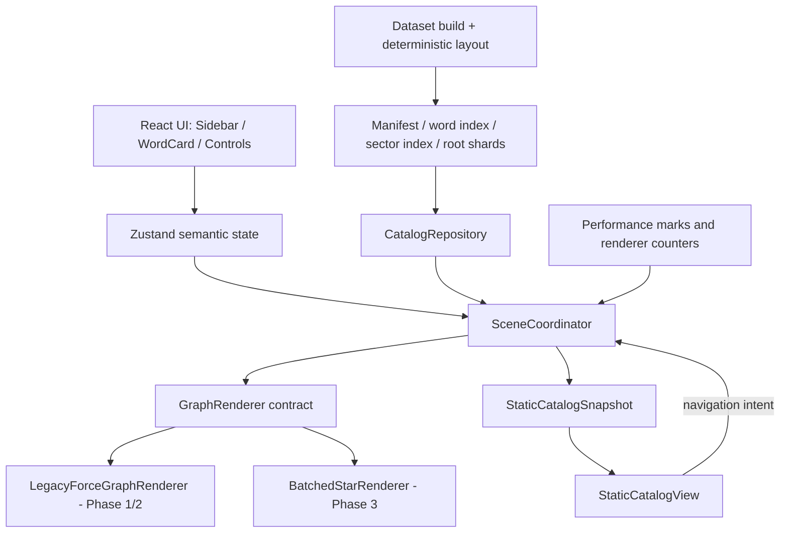

# Star Vocab 三阶段性能架构设计

- 日期：2026-07-19
- 状态：方向已批准，详细规格待用户复核
- 范围：3D 帧率、首屏加载、数千至万级词汇扩展

## 1. 决策

三个方案全部执行，但必须串行演进，不能长期叠加三套实现：

1. **Phase 1：稳住现有 ForceGraph。** 修复构建、依赖、生命周期、状态边界和永久力模拟，建立可信性能基线。
2. **Phase 2：分层星系与预计算布局。** 首屏只显示词根或 sector 概览，按 sector/词根加载索引、单词与关系，运行时不再计算全局力布局。
3. **Phase 3：GPU 批量渲染器。** 在 Phase 2 的稳定数据和布局之上，用批处理 Three.js 渲染器替换 `react-force-graph-3d`。

Phase 1 引入的状态模型、数据索引、性能工具和渲染接口会被后续阶段复用。Phase 2 的 manifest、分片和预计算布局是 Phase 3 的正式输入。Phase 3A 先完成 Batched renderer 功能/性能验收并设为默认；达到量化稳定性证据后，Phase 3B 再删除旧 ForceGraph 渲染器及其依赖。Phase 3B 通过才算第三阶段完成，不保留两套长期生产实现。

## 2. 当前证据

当前数据规模：

- 72 个词根、432 个单词、251 条词间关系。
- 504 个图节点、683 条图边。
- 按节点构造路径估算，节点产生约 2,664 个可绘制对象；另有 683 条独立线和 502 个方向粒子。
- 三个运行时 JSON 合计 198,483 bytes，当前数据不是首要瓶颈。
- Vite 诊断构建的单 JS chunk 为 1,663.25 kB，gzip 458.37 kB。
- 依赖树同时包含 Three.js 0.169 和 0.184。
- 正式 `npm run build` 当前失败，原因包括缺少 Vite 环境类型、Three 类型和 SpriteText 类型兼容。

主要热路径：

- 聚焦词根时，所有节点已经固定，但完整 D3 引擎仍以无限冷却模式运行。
- 节点、线、粒子和标签均按实体创建独立 Three 对象，无法随规模良性扩展。
- 关系线、节点光晕、词根旋转和粒子存在常驻逐帧 CPU 更新。
- Bloom、controls、纹理、材质和场景对象的销毁不完整；StrictMode 会放大重复副作用。
- React 订阅与动画循环轮询 Zustand 并存，选择和进度变化会扩散到多个全量计算。
- 首屏同步导入完整 3D 栈，并等待 roots、words、wordlinks 三份数据全部返回。

上述数据是代码和构建证据。当前未配置 Chrome DevTools MCP，因此没有把 FPS、LCP、INP 或设备帧间隔写成已实测结果。

## 3. 目标与非目标

### 3.1 目标

- 当前 504 节点场景在本机 Apple Silicon Mac 上保持稳定、可测、无永久力模拟。
- 首屏应用外壳和词根概览不再等待完整 3D 依赖、单词详情和关系数据。
- 总词量增长到 5K-10K、词根增长到 2K 时，可见场景成本受可见 LOD 和当前词根簇上限约束，而不是线性跟随总词库。
- GPU 渲染器可在独立压力夹具中批量显示 10K 节点和 30K 边，不退回逐实体 Object3D。
- 所有阶段保持现有词根、单词、关系、掌握度和主要交互语义。
- 每个阶段可独立发布、验收和回退，不迁移或丢失用户进度。

### 3.2 非目标

- 不重新设计视觉主题、侧栏、词卡或学习内容。
- 不在本轮引入后端、账号同步、Service Worker 或完整离线模式。
- 不引入 WebGPU；Phase 3 以 Three.js WebGL2 为目标。
- 不在运行时保留全局力布局。
- 不把每个单词改成 React 组件或 DOM 标签。
- 不承诺在没有真机测试的情况下达到移动 GPU 性能目标。

## 4. 目标架构



### 4.1 语义状态

当前 `selectedWordId` 与 `focusRootId` 可同时存在，允许非法组合。改为一个互斥目标：

```ts
type ViewTarget =
  | { kind: 'overview' }
  | { kind: 'sector'; sectorId: string }
  | { kind: 'root'; rootId: string }
  | { kind: 'word'; rootId: string; wordId: string; nonce: number }
```

`nonce` 表达“重复飞向同一个词”，不再依赖先清空、延时再设置。Store 只保存业务状态，不保存 Three 对象。进度更新发布单词级 renderer patch，但持久化继续同步写入现有 `star-vocab-progress-v1`，payload 保持 `Record<string, Progress>`；本轮不引入防抖、journal、metadata key 或跨标签页语义变化。任何 `localStorage.setItem` 失败都不能静默显示为“已保存”：保留当前内存状态、设置可观察的 `persistenceError` 并提供重试。性能测试连续执行 100 次掌握度写入并记录 p95/最大同步耗时；只有实测超过 8 ms p95，才另开经用户批准的持久化设计，不能在本架构中暗改存储协议。

### 4.2 渲染接口

Phase 1 先把现有实现包进稳定接口，Phase 3 在同一接口后新增批处理实现：

```ts
interface GraphRenderer {
  mount(host: HTMLElement, callbacks: RendererCallbacks): void
  loadScene(scene: SceneSnapshot, options: { signal: AbortSignal }): Promise<void>
  applyPatch(patch: ScenePatch): void
  execute(command: RendererCommand): void
  resize(width: number, height: number): void
  getMetrics(): RendererMetrics
  dispose(): Promise<void>
}
```

`loadScene` 在场景资源提交并完成第一个带正确 `viewEpoch` 和可见计数的业务帧后 resolve；失败时必须 reject 且保留上一个有效场景。渲染器不得 import React 或 Zustand。`StarMap` 只负责创建宿主节点，并挂载或销毁 `SceneCoordinator`；只有 Coordinator 可以订阅与 3D 场景有关的 Store 状态并把它转成命令或 patch。所有逐帧行为由渲染器内部唯一的 FrameScheduler 管理。

Coordinator 同时负责 3D 与静态模式的数据所有权，但不 import React。`StarMap` 创建 Coordinator 时提供 `showStatic(snapshot, reason)` 与 `showCanvas()` host callbacks。`StaticCatalogSnapshot` 是从同一个已校验 repository 和当前 `ViewTarget` 生成的不可变快照，至少包含 `catalogVersion`、`viewEpoch`、target、可导航 sector/root/word/portal 项、当前词卡数据和与 3D readiness 相同口径的可见计数。进入最终静态降级时，Coordinator 先 abort pending load、await renderer dispose，再调用 `showStatic`；`StarMap` 随后只把该快照和 `onIntent` 传给 `StaticCatalogView`。静态组件不得直接读 repository、订阅 Store 或持有 Three 对象；用户导航意图回传 Coordinator，由它递增 epoch、按需加载并发布下一份静态快照。这样 WebGL 与 DOM 路径共享数据校验、竞态和语义状态，React 只拥有当前展示模式。

### 4.3 稳定标识

词根和单词可能共享原始 ID，因此所有场景键使用带类型前缀的稳定形式：

- `root:<id>`
- `word:<id>`
- `sector:<id>`
- `portal:sector:<from-sector-id>:<to-sector-id>`
- `portal:root:<remote-root-id>`
- `rel:<type>:<sorted-endpoint-a>:<sorted-endpoint-b>`

原始 word ID 和 localStorage progress key 保持不变，避免用户进度迁移。

### 4.4 场景快照与 patch

`SceneCoordinator` 是可见业务数据和场景切换生命周期的唯一所有者。它拥有 `CatalogRepository` 与当前 renderer，订阅 Store，并向 renderer 提交不可变 `SceneSnapshot`，或通过 host callback 提交不可变 `StaticCatalogSnapshot`。3D 快照包含 `viewEpoch`、当前 target、可见节点、可见关系、稳定布局和索引。Renderer 可以把快照编译为自己的内部格式，但不得修改或缓存可变业务对象。

完整可见集合、布局版本或 renderer 切换使用 `loadScene(scene, { signal })`。Coordinator 为每个 intent 创建 `AbortController`；新 intent、renderer 切换或 dispose 必须 abort 旧调用。Renderer 将编译和 GPU 上传放进 staging 资源，并在原子交换前、交换后业务首帧 resolve 前两次复核 `viewEpoch`、内部最新 load token 与 signal。交换后仍保留上一场景资源，直到新场景产生第一个带正确 epoch/可见计数的业务帧且 load resolve 才销毁；首帧失败或 resolve 前被 abort 时恢复上一场景。过期或被替代的调用释放自己的 staging 资源并以 `AbortError` reject，不能在新 epoch 开始后继续改变场景、相机或选择；非 Abort 错误保留上一个有效场景。并发调用始终由最新 epoch 获胜。

选择、掌握度、Bloom、质量档和少量轨道状态使用 `applyPatch` 或 `execute`。每个 patch 都携带 `viewEpoch`；renderer 必须拒绝旧 epoch，避免迟到的网络响应或 timer 覆盖新场景。`dispose` 必须先标记 renderer 不再接受调用，再终止全部 pending load；所有 Promise settle 并释放各自 staging 资源后，才释放当前场景和共享资源。dispose 后的 `loadScene` 返回 rejected Promise，`applyPatch` 与 `execute` 同步抛出生命周期错误；Coordinator 必须 await dispose 后才挂载替代 renderer。

## 5. Phase 1：ForceGraph 稳定化

### 5.1 范围

1. 修复类型和构建基线：补齐 Vite/Three 声明，锁定兼容依赖，保证 `npm run build` 通过。
2. 将 Three.js 和对应类型对齐到 0.184.x，锁定 ForceGraph 版本，`npm ls three` 不得出现第二份运行时实例。
3. 动态加载 3D 入口；React 外壳先渲染，3D chunk 立即在空闲或首屏后预载。
4. 抽出 `graphModel`、`GraphRenderer` contract、`LegacyForceGraphRenderer` 和命令式 runtime。
5. 初始布局冷却后停止 D3。词根公转只更新当前簇节点及受影响边，不再设置 `cooldownTime/cooldownTicks=Infinity`。
6. 建立 `nodeByKey`、`rootById`、CSR/邻接索引和受影响边索引，构图改为 O(N+E)。
7. 移除动画循环中的 Store 轮询，改为一次性命令式订阅。
8. 单词标签只在 hover、selected 或 relation-neighbor 状态显示；普通关系粒子只在需要表达链路时启用。
9. 节点脉动最高 30 Hz、关系线呼吸最高 12 Hz；相机和局部轨道保持帧同步。页面隐藏时暂停非必要动画。
10. 完整清理 Bloom pass、render targets、controls 监听、背景资源、临时材质和纹理。
11. 限制 DPR，并提供 high、balanced、low 三档；持续超预算时按第 7.4 节的统一状态机逐级降档。
12. 拆窄 Zustand 订阅，加入同值短路、原子导航 action、`memo(StarMap)` 和行级侧栏更新边界。

### 5.2 模块边界

- `src/graph/graphModel.ts`：纯函数构图、稳定键、节点和邻接索引。
- `src/data/CatalogRepository.ts`：Phase 1 读取 monolith，Phase 2 切换 manifest/shard；只向上输出校验后的业务数据。
- `src/scene/SceneCoordinator.ts`：唯一 3D Store 订阅者，拥有 repository、renderer、epoch、AbortController 和场景生命周期。
- `src/render/contracts.ts`：渲染接口、命令、事件、patch 和指标。
- `src/render/LegacyForceGraphRenderer.ts`：现有 ForceGraph 的唯一适配层。
- `src/render/graphRuntime.ts`：背景、Bloom、controls、动画、局部轨道和生命周期。
- `src/components/StarMap.tsx`：创建宿主节点并挂载/销毁 Coordinator；只根据 Coordinator host callback 在 canvas 与 `StaticCatalogView` 间切换，不直接订阅 3D 状态、读取 repository 或接触 Three 对象。
- `src/components/StaticCatalogView.tsx`：消费不可变 `StaticCatalogSnapshot`，通过 `onIntent` 把导航交回 Coordinator；无 WebGL2 或 renderer 最终失败时提供可导航 DOM 学习界面，并负责在内容真实提交后发出 `fallback-ready`。
- `src/store/useStore.ts`：语义状态、进度 patch 和持久化。
- `tests/perf`：确定性夹具、性能脚本和报告，不进入生产包。

### 5.3 验收门槛

- `npm run build` 退出码为 0，控制台无 Three 多实例警告。
- 初始入口 JS 不超过 120 KiB gzip；包含懒加载 3D chunk 的全部生产 JS 不超过 430 KiB gzip。
- C0 冷缓存 `navigationStart -> shell-ready`：D1 p75 不高于 500 ms、p95 不高于 800 ms，D2 p75 不高于 1.2 秒、p95 不高于 2 秒；`navigationStart -> first-scene-frame`：D1 p75 不高于 2 秒、p95 不高于 3 秒，D2 p75 不高于 4 秒、p95 不高于 6 秒。首个业务帧前 HTML/CSS/JS/monolith JSON 合计不超过 650 KiB gzip。
- 当前数据、1440x900、设备 DPR 2、锁定 high 档且实际 DPR 1.75、Bloom 与关系粒子开启时，概览、选词、聚焦三场景中位 FPS 均不低于 50，p95 帧间隔不高于 33.3 ms。采样期间禁用自动降档。
- 聚焦场景 p95 帧间隔较 Phase 1 变更前基线改善至少 25%，或达到 20 ms 以内。
- 初始布局结束后，概览和聚焦各观察 10 秒，D3 tick 均为 0；当前词根下单词仍正常公转且边端点同步。
- 点击到词卡或链路首个视觉反馈 p95 不高于 100 ms。
- StrictMode 下 composer 只有一个 Bloom pass，每类 controls 监听只有一个。
- 连续挂载/卸载 10 次后，geometry、texture、listener 和命名场景对象不单调增长。
- 连续 100 次掌握度写入的同步 localStorage p95 不高于 8 ms；写入异常提示和重试通过，主 key 及其 `Record<string, Progress>` payload 保持不变。
- 桌面和手机视口的截图、canvas 非空像素、拖拽、缩放、选词、词根公转、关系链、Bloom 和进度刷新全部通过。

性能数字是待实现门槛。第一份自动报告只建立基线，不得把未采集指标写成已达标。

### 5.4 回退

- Three 升级、力模拟停止、标签策略和质量策略分别提交，允许逐项回退。
- 迁移期保留 `legacyForceOrbit` 开关，仅用于验证新局部轨道；Phase 1 验收后删除。
- 共享 GPU 资源由 registry 统一拥有和销毁，组件不得随意 dispose 共享实例。
- Phase 1 不改变数据 schema、progress key、payload 或写入时序，因此回退不需要迁移用户数据。

## 6. Phase 2：分层星系与预计算布局

### 6.1 资产模型

现有 `roots.json`、`words.json` 和 `manual-links.json` 继续作为人工源。Phase 2 新增一个提交态布局输入，并由构建脚本生成版本化资产：

```text
public/data/v2/manifest.json
public/data/v2/word-index.<hash>.json
public/data/v2/sectors/<sector-id>.<hash>.json
public/data/v2/roots/<root-id>.<hash>.json
scripts/layout-lock.v2.json                  # 提交到版本库的构建输入
```

`manifest.json` 使用稳定 URL 和 `no-cache`；word index、sector index 和 root shard 都使用内容哈希文件名与 immutable cache。manifest 包含：

- `schemaVersion`、`catalogVersion`、`layoutVersion`，以及每个 AssetRef 的 URL、SHA-256、原始 UTF-8 bytes 和 gzip bytes。
- roots 的完整概览字段、固定位置、sector ID、词数和 shard AssetRef。
- 总词数、关系数、跨根关系数。
- sector 的固定位置、root 数、sector index AssetRef，以及 sector-to-sector 聚合关系；root 总数不超过 300 时，manifest 还直接携带裁剪后的 root-to-root 聚合关系。
- word index AssetRef。

轻量 word index 包含 `id`、`word`、`rootId`、`def_zh` 和稳定顺序，用于全局搜索、随机选择和跨根下一词，不包含例句和完整词卡详情。

sector index 包含该 sector 内的 root-to-root 聚合关系、通向相邻 sector 的 portal 摘要和稳定计数。它只控制概览 LOD，不是 canonical 关系来源；所有完整词间关系仍由 root shard 保存。

每个 root shard 包含：

- 完整 Word 字段。
- 构建期生成并锁定的轨道半径、相位、倾角、升交点和角速度。
- 同根 canonical relations。
- 跨根关系的本端投影，包括稳定 relation ID、远端词 ID、词名和 root ID。

### 6.2 布局与关系规则

- 根布局以固定 seed 在构建期计算并写入 `scripts/layout-lock.v2.json`。该文件的最小格式为：

```json
{
  "schemaVersion": 2,
  "algorithmVersion": "galaxy-layout-2",
  "seed": "star-vocab-layout-v2",
  "sectors": {
    "<sectorId>": {
      "rootIds": ["<rootId>"],
      "position": [0, 0, 0]
    }
  },
  "roots": { "<rootId>": [0, 0, 0] },
  "words": {
    "<wordId>": {
      "rootId": "<rootId>",
      "radius": 0,
      "phase": 0,
      "inclination": 0,
      "ascendingNode": 0,
      "angularVelocity": 0
    }
  }
}
```

- 数值写入前按固定精度量化；`layoutVersion` 是 canonical JSON 的 SHA-256。普通 `npm run data` 和 CI 只读该 lock，遇到缺项、孤儿项或算法版本不符就失败，不能静默改坐标。
- sector ID、root membership 和 sector position 都属于 lock。`npm run data:layout -- --add-missing` 固定既有 membership，把新 root 确定性放入未满 sector 或追加新 sector；`npm run data:layout -- --prune` 只删除已移除 ID 和空 sector；只有 `npm run data:layout -- --reflow` 可以改变既有 membership 或全局重排。三种变更都必须提交 lock diff。`--reflow` 还必须附固定相机截图、性能报告和独立审查；回退时同时 revert lock 与对应生成资产，再按 assets-first 顺序重新发布旧 manifest。
- 单词轨道参数来自同一 lock，运行时 D3 tick 恒为 0。
- 同根关系只存在所属 shard 一份。
- 跨根关系在两端 shard 各投影一次，payload 必须一致，并以 relation ID 去重。
- 构建器先生成全局 canonical 关系图，再聚合 root 与 sector 关系；概览裁剪不删除 canonical 数据。
- 只有一端 shard 可见时，跨根投影在整个快照内按 remote root 全局聚合为一个 root portal，不再按 local root 拆组；来自多个可见 local roots 的 relation 可以连到同一 portal。portal 使用 `portal:root:<remote-root-id>`，CPU sidecar 保留完整 relation IDs 和 contributing local root IDs。两端过渡同时加载时，目标 root 已可见的 relation 改连真实词节点并按 relation ID 去重；其余投影仍遵循同一全局分组。点击聚合 portal 进入远端 root；点击词卡中的具体 relation 可直接进入对应远端 word。

### 6.3 Root LOD

- root 总数不超过 300 时，直接显示全部 root，但按关系计数降序、稳定 endpoint ID 次序最多显示 600 条聚合边；当前 72-root 视觉语义不变。
- root 总数超过 300 时，最外层只显示构建期生成的 sector。每个 sector 最多 200 roots；ROOT2K 夹具的可见 sector 节点不超过 64、sector 边不超过 128。
- 进入 sector 后最多显示 200 个本 sector roots、32 个相邻 sector portal 和 600 条 root 聚合边。root/word 聚焦场景最多保留 200 个 root 上下文、32 个 sector portals 和全场 64 个按 remote root 聚合的 root portals，总上下文节点不超过 296。
- root shard 受 300 words、1,200 个 relation records 和单 word degree 128 的构建上限约束，过渡期最多同时显示两个词簇。因此任何正式 Phase 2 场景最多包含 300 个 root/portal 上下文节点、600 个 word 节点、600 条 member 边、2,400 条可见 word relation 边和 600 条概览聚合边。超出任一 shard 关系上限时构建失败，必须先单独设计关系分页/LOD，不能把数万条边直接交给运行时。
- root portal 全局 remote-root 组按“包含 selected relation target 优先、关系条数降序、remote root ID 升序”确定 64 个可见组，最后一项是完整稳定 tie-break。选中一个原本不可见的具体 relation 时，它唯一对应的 remote-root 组替换最低优先级组。没有可见 portal 的其余跨根投影仍保留在 root shard/词卡，可直接导航，但本帧不生成节点或边。概览边配额使用同样的确定性优先级。LOD 只裁剪 `SceneSnapshot` 投影，不删除 word index、root shard 或 canonical relation。

### 6.4 加载流程

1. 网络优先加载并校验 manifest，按 root 数选择 direct overview 或 sector overview，不等待 word index、sector index 或任何 root shard。
2. 第一个场景 readiness gate 之前不得请求 word index。WebGL 路径以 `first-scene-frame` 为 gate；无 WebGL2 的 DOM/静态路径由 `StaticCatalogView` 在 manifest 内容已经 React commit、下一次 rAF 后且 DOM 断言可导航时发出 `fallback-ready`。gate 之后，仅在用户实际发起搜索/随机选择时立即加载，或在至少 1 秒后的 idle callback 中加载；侧栏默认打开本身不能触发请求。
3. 用户选择 sector 或 sector portal 时产生 `{ kind: 'sector' }` intent，递增 `viewEpoch` 并调用可合并的 `ensureSector(sectorId)`。sector index 校验成功后原子提交 sector snapshot；失败保留原 overview/sector。退出 sector 回 overview；从 root/word 退出时，root 总数超过 300 则回到该 root 的 locked parent sector，否则回 overview。
4. 用户选择 root 时，镜头先飞向已有 root 或 portal，同时 `ensureRoot(rootId)` 合并重复请求。来自搜索或跨根 portal 的 root 可以直接进入，不要求 sector index 已加载。
5. shard 校验成功后构造完整 `SceneSnapshot`，以单次原子提交切换场景。每个导航 intent 都递增 `viewEpoch`；快速连续点击只允许最后一个响应提交。
6. 跨根跳转先加载目标 shard，成功后原子切换 selection 和场景；失败保留当前场景与词卡。
7. 过渡期间最多保留两个簇，完成后释放旧簇渲染对象。退出或切换 sector/root 必须 abort 被替代的 sector 与 root 请求。
8. 解析后的 root shard 使用内存 LRU。计数包含 pinned 项，容量同时受 8 shards 和 8 MiB 原始 UTF-8 bytes 约束；加入新项会超过任一上限时，就从最旧的 unpinned 项开始淘汰，直到两个条件都满足。当前簇和过渡簇 pinned，不可淘汰；`navigator.deviceMemory <= 4` 时上限减为 4 shards / 4 MiB。bytes 口径固定使用 manifest 的 `AssetRef.bytes`，不以引擎相关 heap 估算代替。

### 6.5 错误、缓存与降级

- 共享请求由 Promise cache 合并；单个消费者不得中止其他消费者共用的请求。
- 408、429、5xx 最多重试两次；404 先强刷 manifest 一次处理部署切换。
- JSON、schema 或 hash 错误时清除该缓存并重取一次；仍失败则保留当前场景并允许重试。
- 旧 epoch 的晚响应静默丢弃，不能清空或覆盖新场景。
- word index 加载中时保留已输入查询，但不提交全局导航。加载失败后，搜索只匹配已加载 shard 并显示可重试状态；随机选择只从当前已加载 shard 的未掌握词中选择；“掌握并下一词”也只在当前 shard 内前进。当前 shard 没有候选词时保持现有 selection 并提供重试，不能随机跳到未知 ID。直接点击跨根 relation portal 仍可依靠投影中的 root/word ID 加载远端 shard，不依赖 word index。
- 仅布局损坏时使用基于 ID 的确定性备用环形布局；内容或引用损坏则拒绝整个 shard。
- `saveData`、2G 或页面隐藏时关闭预取；普通状态最多空闲预取两个高频跨根邻居。
- Phase 2 不引入 Service Worker，也不承诺首次离线访问。

### 6.6 原子发布与版本兼容

1. `/data/v2/` 只发布 `schemaVersion: 2`。任何 breaking schema 使用新的 major 路径，例如 `/data/v3/manifest.json`；旧应用不会读取新 major manifest。
2. 每次发布先上传所有内容哈希资产，再从实际发布 origin 逐个取回并校验 status、bytes 和 SHA-256，全部通过后才原子替换对应 major 的 `manifest.json`。新 major 的应用 shell 在其 manifest 可用后发布。
3. 已发布的哈希资产至少保留两个稳定版本且不少于 30 天，以较长者为准；回退演练期间禁止清理。manifest 引用的资产不允许原地覆盖。
4. 客户端先做 manifest 自身的 schema、catalog/layout version、内部引用和 AssetRef 字段格式校验；该结构校验及首个 scene readiness gate 通过后，才把 manifest 写入 CacheStorage 的同 major `last-known-good` 项，不会为此提前下载懒加载资产。word index、sector index 和 root shard 在首次按需获取时分别校验 status、bytes 与 SHA-256，并按 AssetRef 独立记录为已验证。网络 manifest 失败或不兼容时先回退 last-known-good；任一当次必需资产缺失则保留原场景并放弃本次导航，不能拼接新旧 catalog。
5. 首次启动没有 last-known-good 时，迁移期回退 bundled monolith；monolith 删除后保留 React 外壳和可重试错误状态，不挂载空白或半成品 3D 场景。

### 6.7 构建不变量

- 每个 word 恰好属于一个 root，无悬空引用。
- 同根 relation 恰好一份；跨根 relation 恰好两个一致投影。
- 聚合计数必须与 canonical relations 一致。
- 所有坐标有限，轨道半径有效，渲染键无冲突。
- 相同输入连续构建必须字节一致，不写非确定性构建时间。
- 增量构建必须先按完整输入重算 canonical 关系依赖图，再按新旧图 diff 决定受影响资产。word 字段变化至少使 manifest、word index 和所属 root shard 失效；若全局前缀族等推断规则改变任一关系，还必须使每条变更关系的两个端点 shard 及其一到两个 sector index 失效。不得硬编码“只改所属 root”的假设。
- 手工新增一条跨根关系时，预期改变 manifest、两个端点 shard 和端点所属的一到两个 sector index，不改变 word index；构建测试以实际 canonical graph diff 为准，并专门覆盖“新增前缀词导致远端 shard 与 sector index hash 改变”的情况。
- 单个 root shard 超过 300 words、1,200 个 local-plus-cross relation records、单 word degree 128、1 MiB 原始 UTF-8 bytes 或 64 KiB gzip 中任一门槛时构建失败，要求单独设计热点根或关系分页。该 raw-byte 上限保证低内存档同时 pin 两个最大 shard 时仍低于 4 MiB LRU 上限。

### 6.8 验收门槛

- 当前 72/432/251 数据的字段、关系、progress key 和交互语义全部保留。
- CAT5K 固定 300 roots，CAT10K 固定 600 roots，ROOT2K 固定 2,000 roots / 10K words。三个夹具都必须命中上述可见节点和聚合边上限；不得为通过测试临时减少源数据。
- `LOD_MAX` 使用两个各含 300 words / 1,200 relation records 的最大 shard，过渡快照固定为 200 roots、32 sector portals、64 root portals、600 words、600 member edges、2,400 word relation edges 和 600 overview edges；必须可加载、交互和释放，且不触发未声明的运行时裁剪。另用 1,200 个跨根投影指向 1,200 个 remote roots，断言只生成 64 个 root portals，并且选择第 1,200 个 relation 后其 portal 按规则进入场景；再让两个可见 local roots 同时投影到一个 remote root，断言只生成一个稳定 portal key 且 sidecar 包含两个 local root IDs。
- `LOD_MAX` 在 D1、locked balanced、actual DPR 1.25、Bloom/粒子质量功能开启时，中位 FPS 不低于 40、`presentIntervalMs` p95 不高于 40 ms、点击反馈 p95 不高于 200 ms；内存命中后的 scene compile/commit 不高于 1 秒，且不得出现超过 100 ms 的单个主线程 long task。
- `first-scene-frame` 前的数据请求只有 manifest，不请求完整 words、wordlinks、word index、sector index 或 root shard。
- WebGL 路径的 word index `PerformanceResourceTiming.startTime` 必须晚于 `first-scene-frame`；静态降级路径必须晚于 `fallback-ready`。测试中的默认打开侧栏不能提前触发它。
- 100 roots 的 manifest 不超过 50 KiB gzip；ROOT2K manifest 不超过 350 KiB gzip，任一 sector index 不超过 32 KiB gzip。
- 初始 entry JS 不超过 120 KiB gzip。冷缓存 `app-start -> first-scene-frame`：D1 p75 不高于 1.5 秒、p95 不高于 2.5 秒；D2 p75 不高于 3 秒、p95 不高于 5 秒。CAT5K 首帧前 HTML/CSS/entry/3D chunk/manifest 合计不超过 650 KiB gzip，ROOT2K 不超过 950 KiB gzip。
- D1 本机冷 shard 切换到可交互 p95 不高于 500 ms，D2 受限桌面不高于 800 ms，内存热切不高于 150 ms。
- CAT5K、CAT10K 和 ROOT2K 都编译为同一个 `LOD_COMPARE` 快照：200 roots、32 portals、50 words、50 member edges、150 word relation edges、600 overview edges，无过渡簇。三者的 draw calls 和 `presentIntervalMs` p95 差异均不超过 10%；另外分别测试 CAT5K direct overview、CAT10K sector entry 和 ROOT2K sector entry 的真实导航路径。
- CAT5K 在 D1、locked balanced 档、actual DPR 1.25、Bloom 与粒子质量功能开启时，概览和聚焦中位 FPS 不低于 55，p95 帧间隔不高于 20 ms，D3 tick 恒为 0；采样中任一质量状态变化都使结果失败。
- 按第 8 节强制 GC 协议连切 30 个 root 后，LRU 同时满足数量与 bytes 上限；强制 GC 后的 CDP used heap、geometry 和 texture 数量保持在规定平台期容差内。
- 快速连续点击 10 个 root 只提交最后一个，无未处理 Promise rejection。
- 现有全部跨根关系双向可见，远端跳转正确，过渡时无重复边。
- 404、超时、损坏 JSON、hash 不符和旧响应晚到的故障注入均不能清空当前星图。

### 6.9 回退

- `VITE_DATA_MODE=monolith|sharded` 在迁移期选择旧单体数据或新分片数据。
- 两种数据模式都输出同一 `SceneSnapshot`，渲染器不感知网络格式。
- 只有满足第 9 节的量化退出条件，才删除 monolith 运行时分支；人工源、layout lock、生成器、hash 校验和旧发布标签继续保留。

## 7. Phase 3：GPU 批量渲染器

### 7.1 渲染数据

`SceneCompiler` 将 Phase 2 的 `SceneSnapshot` 编译为密集 typed arrays：

- `positions: Float32Array`，每节点 xyz。
- `colors: Uint8Array`，每节点 rgba。
- `sizes`、`kinds`、`parentIndices`、`mastery`、`nodeFlags`；`kinds` 至少包含 sector、root、word、sector-portal 和 root-portal。
- 轨道基向量、半径、角速度和运动状态。
- `endpoints`、`edgeKinds`、`relTypes`、`edgeColors`、`edgePhases`。
- CSR 形式的 `edgeOffsets` 和 `edgeIndices`。
- 字符串、词卡内容以及 portal 的目标 sector/root、聚合 relation IDs 与远端 word IDs 保留在 CPU sidecar，不上传 GPU。

节点按 root 连续排列，方便局部上传。位置和运动状态放入浮点 DataTexture，节点、边、粒子和 picking shader 共用 `resolveNodePosition(index, time)`；公转时不再分别用 CPU 更新节点和全部连线。

### 7.2 GPU 批次

目标场景批次：

| 批次 | 实现 |
|---|---|
| 星体核心 | 单个实例化 billboard/SDF batch |
| 光晕、亮核、选中环 | 单个 additive billboard batch |
| 词根线框 | root-only InstancedMesh |
| member 线 | 单个 LineSegments batch |
| relation 线 | 单个 LineSegments batch，shader 呼吸 |
| 关系粒子 | 单个 Points batch，shader 沿边插值 |
| 背景星 | 单个 Points batch |
| 星云 | 单个实例化 billboard batch |
| 流星 | 固定容量实例环形缓冲 |

不得为每节点创建独立 Mesh、SpriteText 或材质。sector、root、word 与两类 portal 共用节点批次，通过 kind/flags 在 shader 中区分外观；掌握度、锁灰、邻居、选中和关系链状态通过 uniforms、flags 和局部纹理 patch 表达。全场锁暗只改全局 uniform，不遍历上传全图状态。

### 7.3 拾取与标签

- 使用 1x1 GPU ID picking pass，节点密集索引加一编码为 RGB，0 表示背景。
- hover 最多 30 Hz，移动小于 2 CSS px 不重复 picking；拖动相机时暂停。
- click 强制 picking，但可复用 50 ms 内同坐标 hover 结果。
- 视觉星核较小时仍保持 word 至少 12 px、root/portal 至少 18 px、sector 至少 22 px 的点击半径。
- 标签使用透明 Canvas2D overlay，不再为每个词创建纹理。
- 标签优先级为 selected、hover、current sector/focused root、navigation portal、relation neighbor、普通 root、普通 word。
- desktop 最多 80 个标签，mobile 最多 40 个；selected 和 hover 标签不受配额影响。
- 相机移动时标签最高 30 Hz 更新，静止时仅在状态变化后更新。

### 7.4 动画与后处理

- `FrameScheduler` 是唯一 rAF。
- 呼吸、关系闪烁、粒子和背景旋转在 shader 中使用统一 `uTime`。
- `document.hidden` 时完全暂停；`prefers-reduced-motion` 时关闭公转、呼吸、流星和闲置旋转。
- high、balanced、low 是用户选择的质量 ceiling；显式选择会立即应用对应起始状态并重置迟滞计数，自动恢复永远不能高于该 ceiling。完整有序状态为 `high = 1.75 / particles on / Bloom on`、`balanced = 1.25 / on / on`、`low = 1.0 / on / on`、`low-no-particles = 1.0 / off / on`、`minimal = 1.0 / off / off`。balanced ceiling 排除 high，low ceiling 排除 high 和 balanced；恢复严格按相反顺序进行。上述状态中的 Bloom on 只是质量许可，实际状态仍为 `userBloomEnabled && qualityAllowsBloom`，自动恢复不得重新打开用户明确关闭的 Bloom。
- 自适应质量只使用 `rendererWorkMs` 的 EWMA。`rendererWorkMs` 从进入当前 rAF 的 FrameScheduler 工作段开始，到相机、标签、场景更新和 renderer/composer CPU 提交全部返回时结束，不包含等待下一次 rAF 的空闲时间。high、balanced、low 的 work budget 分别为 16.7、20、33.3 ms，后两个低档状态沿用 33.3 ms。EWMA 严格高于当前状态 budget 的 1.2 倍并连续 120 个样本时只下降一级；EWMA 严格低于候选上一级 budget 的 0.8 倍并连续 300 个样本时只恢复一级。进入新状态、样本落入迟滞区或越过相反阈值都会重置对应连续计数。`presentIntervalMs` 不进入该 EWMA，`rendererWorkMs` 也不得用于 FPS 或 p95 展示门禁。
- 后处理由 renderer 完整拥有：`RenderPass -> UnrealBloomPass -> OutputPass`。
- Bloom 关闭时绕过 composer 直接渲染。
- DPR 上限由上述质量状态唯一决定，不另设可产生第六种组合的隐式档位。
- `dispose()` 释放 geometry、material、texture、render target、监听和 controls。
- 监听 WebGL context lost/restored；一次 restore 失败后严格执行第 7.5 节定义的 Phase 3A Legacy 或 Phase 3B `StaticCatalogView` 路径。

### 7.5 迁移顺序

1. 保持 `LegacyForceGraphRenderer` 为默认，新增 `BatchedStarRenderer` 静态节点、相机和背景。
2. 通过 `?renderer=batched` 独立验证节点、边、GPU picking 和 Canvas 标签。
3. 加入轨道、关系链、粒子、Bloom 和自适应质量，完成行为与视觉回归。
4. 默认切换为 batched；旧 renderer 改为动态 import，不进入首屏 chunk。
5. 只有满足第 9 节量化退出条件，才删除 `react-force-graph-3d`、`3d-force-graph`、`three-forcegraph` 和 `three-spritetext`。
6. 删除旧实现后，无 WebGL2 时保留 Sidebar 和 WordCard，显示简化静态背景；完整 3D 回退通过上一发布标签完成。

迁移期支持：

- 构建默认：`VITE_GRAPH_RENDERER=legacy|batched|auto`。
- 开发验收：`?renderer=legacy|batched`。
- 任一时刻只能挂载一个 renderer，避免双倍 GPU 内存。
- Phase 3A 中 Batched renderer 初始化、shader 编译、picking 或 context restore 失败时，先完整销毁，再且仅再尝试挂载一次 Legacy renderer 并恢复语义状态；Legacy 的 mount、首个 `loadScene` 或后续 context restore 任一失败，都必须完整销毁并由 Coordinator 发布 `StaticCatalogSnapshot`，不得递归重试或留下空白 canvas。Phase 3B 删除 Legacy 后，同类失败直接进入该静态路径。

### 7.6 Phase 3A：Batched 功能与性能验收

基准环境固定为第 8.2 节 D1，renderer 锁定 balanced 档并将实际像素比固定为 1.25。每个动画场景预热 5 秒、运行 30 秒、重复 3 次取中位数。正式 FPS 采样禁用自适应降档，并按第 8.3 节独立断言整段采样中 actual DPR=1.25、粒子质量功能开启；Bloom-on 场景必须始终为 true，Bloom-off 对照必须始终为 false。任一状态偏离预设都使本次结果失败，不能用降低视觉质量换取通过。

- 当前 504/683 场景、Bloom 开启：中位 FPS 不低于 55，`presentIntervalMs` p95 不高于 20 ms。
- GPU10K 夹具（10K 可见节点、30K 边）、Bloom 开启：中位 FPS 不低于 45，`presentIntervalMs` p95 不高于 25 ms。
- GPU10K、Bloom 关闭：中位 FPS 不低于 55。
- 非后处理 scene draw calls 不超过 20；包含 Bloom 的总 draw calls 不超过 60。
- 初始入口 JS 不超过 120 KiB gzip，批处理 renderer chunk 不超过 300 KiB gzip；默认 batched 路径实际传输的全部 JS 不超过 380 KiB gzip。动态 Legacy fallback chunk 单独记录，在 3A 不计入默认路径传输预算。
- picking p95 不高于 8 ms；点击到首个视觉反馈 p95 不高于 150 ms。
- 10K 场景的 scene compile 与 GPU upload 不高于 1.5 秒，单个主线程 long task 不高于 100 ms。
- 连续挂载/卸载 20 次、切换星系 100 次后，GPU 资源和监听器不单调增长。
- direct overview、sector 进入/退出、sector portal、跨根 root portal、选词、锁灰、关系链、词根公转、背景清空、闲置旋转、掌握度着色和 Bloom 行为保持一致；ROOT2K 正式导航路径必须通过 Batched renderer。
- `npm ls three` 只出现一个运行时版本；正常启动与全部正式场景都不得下载 Legacy fallback chunk。
- GPU25K 仅作为 stretch：要求不崩溃、不丢 WebGL context，并记录指标，不将结果宣传为正式容量承诺。

### 7.7 Phase 3B：兼容分支清理验收

- Phase 3A 已满足第 9 节针对 Legacy renderer 的两个稳定发布、设备矩阵、零失败正常场景和回退演练条件。
- 删除 `LegacyForceGraphRenderer`、renderer 选择开关及 `react-force-graph-3d`、`3d-force-graph`、`three-forcegraph`、`three-spritetext`；生产依赖树只保留一份 Three.js。
- 删除后全部生产 JS gzip 不超过 380 KiB，Phase 3A 的功能、视觉、locked-quality、ROOT2K、GPU10K 和资源平台期门禁必须重新通过。
- 无 WebGL2、shader 初始化失败或 context restore 失败统一由 Coordinator 终止 renderer 生命周期、发布 `StaticCatalogSnapshot` 并切换到 `StaticCatalogView`，再由静态组件发出 `fallback-ready`；完整 3D 回退只通过上一稳定发布标签，不在新 bundle 内保留第二引擎。

### 7.8 回退

- Phase 3A 迁移期间，Batched 的 shader、picking 或 context restore 失败最多回退 Legacy renderer 一次；Legacy 失败后终止在 `StaticCatalogView`。
- Phase 3B 删除 Legacy renderer 后，运行时只做质量降级和 `StaticCatalogView` 降级；完整回退使用上一稳定发布。
- 不同时保留两份 Three.js 或两套已挂载 scene。

## 8. 性能基准与测试

### 8.1 确定性夹具

- `C0`：当前真实数据，72 roots、432 words、251 relations。
- `C2`：2 倍合成，验证 Phase 1 余量，不作为长期容量承诺。
- `CAT5K`：300 roots / 5K words，含 50-word/150-relation 热点簇，Phase 2 主门禁。
- `CAT10K`：600 roots / 10K words，验证 sector LOD 和可见成本与总词库解耦。
- `ROOT2K`：2,000 roots / 10K words，验证高 root 数、manifest 预算和 root/edge 可见上限。
- `LOD_MAX`：两个满载 300-word/1,200-relation shards，验证 Phase 2 最大正式可见快照和资源释放。
- `GPU10K`：10K 可见节点、30K 边，含一个 degree=500 hub，Phase 3 主门禁。
- `GPU25K`：25K 可见节点、75K 边，只做非崩溃 stretch。

生成器必须固定 seed，禁止 self-edge 和重复边，并记录节点数、边数、最大度和关系密度。测试夹具不得写入产品词库。

### 8.2 环境

- D1：用户本机 Apple Silicon Mac，Chrome headed，1440x900、设备 DPR 2，显示刷新率固定 60 Hz。机器接电、低电量模式关闭，计分前 thermal state 必须为 nominal。记录芯片、内存、OS build、浏览器 executable 实路径与 major、WebGL vendor/renderer、设备 DPR、电源和 thermal state。
- D2：同一台 Mac、同一 60 Hz/接电/低电量关闭/thermal nominal 条件，1365x768、DPR 1、CPU 4x、5 Mbps、100 ms RTT，用于首屏和主线程预算；不得冒充移动 GPU。除 viewport、DPR 和节流参数外，记录与 D1 相同的环境字段。
- D3：Pixel 7a（Tensor G2、8 GB）真机，显示刷新率固定 60 Hz、Battery Saver 关闭、横屏 915x412 CSS viewport。记录 Android build、Chrome executable/package 与 major、设备 DPR、WebGL vendor/renderer、电池状态和每次计分前后的 thermal status；thermal status 改变的轮次单独记录，不能并入稳定样本。renderer 使用 locked balanced 档、actual DPR 1.25、Bloom/粒子质量功能开启。Phase 2 硬门禁为 C0 direct overview 与 CAT10K sector path 各完成 30 次启动/sector/root 切换且无空白场景、未处理异常或意外 monolith 回退。Phase 3 硬门禁为 C0 连续交互 10 分钟，中位 FPS 不低于 40、`presentIntervalMs` p95 不高于 40 ms、点击反馈 p95 不高于 200 ms，并且无 WebGL context loss；GPU10K 在 D3 只记录诊断结果。没有该参考设备结果时，不得宣称移动 GPU 达标或删除最后兼容分支。
- CI headless：门禁构建、包体、请求、功能、标记、相对回归和 canvas 非空，不用 SwiftShader FPS 作产品结论。
- 性能报告必须保存环境签名：设备/芯片、OS build、浏览器 executable 与 major、viewport、显示刷新率、设备 DPR、WebGL vendor/renderer、电源/低电量/thermal 状态，以及 D2 的节流参数。签名任一字段变化时，绝对预算仍须通过，但不得与旧 baseline 做相对比较；必须在新签名下重新建立 baseline。

### 8.3 工具与协议

- 性能、包体、网络、视觉和生产生命周期只测 production build。浏览器门禁使用固定的 benchmark static server，不用 Vite dev server；它提供预生成 gzip 响应、manifest `no-cache` 和哈希资产 `public,max-age=31536000,immutable`。唯一例外是 React StrictMode 重复 effect 测试，它在 development build 单独运行且不采集 FPS；production 另用测试 harness 显式执行挂载/卸载循环。
- 随机星海、流星和布局使用固定 seed；TTS 在性能测试中禁用。
- 所有 FPS、median 和 p95/p99 帧门禁统一采集 `presentIntervalMs[i] = rafTimestamp[i] - rafTimestamp[i-1]`；median FPS 定义为 `1000 / median(presentIntervalMs)`。`rendererWorkMs` 只供自适应质量 EWMA 使用，不能替代相邻 rAF 间隔、参与 FPS 门禁或用于跨阶段相对性能结论。文档中的“帧间隔”均指 `presentIntervalMs`。
- locked-quality 测试必须独立校验实际 DPR。测试从 `canvas.getBoundingClientRect()` 取得 CSS width/height，并从真实 WebGL context 读取 `gl.drawingBufferWidth/Height`；宽高必须分别满足 `abs(drawingBuffer - round(cssSize * presetDpr)) <= 1 px`，同时报告 `drawingBufferWidth / cssWidth` 与 `drawingBufferHeight / cssHeight`。`__STAR_PERF__` 自报的 actual DPR 只能交叉检查，不能作为通过依据。
- 增加 `app-start`、`shell-ready`、`data-ready`、`first-scene-frame`、`fallback-ready`、`layout-ready`、`cluster-visible`、`card-painted` 和 `chain-start` marks。HTML 中位于 module script 前的内联代码必须执行 `performance.mark('app-start', { startTime: 0 })`，明确以 `performance.timeOrigin`/navigation start 为起点，把 HTML、entry 获取、解析和执行都计入首屏。`shell-ready` 由应用外壳在 header、sidebar 和 controls 已 React commit、下一次 rAF 后且 DOM 断言可操作时发出；`fallback-ready` 只能由 `StaticCatalogView` 按第 6.4 节条件发出。
- test-only `__STAR_PERF__` 只读暴露 renderer.info、visible counts、force tick count、quality ceiling/current state、actual DPR 自报值、Bloom/粒子实际状态、活动 rAF/listener 数，以及分别命名的 `presentIntervalMs` 和 `rendererWorkMs` samples。
- 冷启动复用同一个已就绪 static server，执行 1 次非计分预热加 D1、D2 各 30 个全新 browser context，以 nearest-rank 计算 p75/p95。每个计分 context 清除全部 origin storage 和浏览器 cache，再只注入固定的 progress localStorage fixture。动画执行 3 段并报告 median FPS、p95/p99 帧间隔和超过 50 ms 帧比例。
- LCP 仅作参考。`first-scene-frame` mark 必须在 detail 中携带当前 `viewEpoch` 及已提交的 visible root、sector、portal、word、member-edge、word-relation-edge、overview-edge 数量；测试将其与目标 `SceneSnapshot` 精确匹配。canvas 非背景像素只用于排除黑屏，不能单独证明业务场景完成。无 WebGL2 时 `fallback-ready` 携带相同 catalog/viewEpoch 与 DOM 可导航计数，作为 word index 延迟加载的等价 gate，但不冒充 3D 首帧。
- 交互延迟从原始 pointer/keyboard event 的 `timeStamp` 计算。`card-painted` 只能在目标 word 的 React commit 完成、下一次 rAF 后且 DOM 断言匹配该 word ID 时发出；`chain-start` 只能由 renderer 在首个包含目标 chain flags 的已提交 frame 后发出，并携带 renderer frame ID 与 `viewEpoch`。普通状态更新函数调用完成不能作为视觉反馈。
- CI 保存带环境签名的 JSON baseline，同时检查绝对预算与同签名相对回归；同签名下超过 10% 才报警，签名不一致时拒绝计算相对差值。
- FPS 门禁使用 locked-quality 模式；自适应策略在另一项 10 分钟 soak 中使用 test-only `syntheticRendererWorkMs` 注入器验证。注入器不忙等，而是在每帧 renderer 工作后、EWMA 更新前替换本帧 `rendererWorkMs`，真实 `presentIntervalMs` 另行记录。high、balanced、low 每个基础状态都要独立做边界测试：稳定预置 EWMA 后注入该状态 budget 的 1.19 倍连续 130 个样本不得降级，重新预置后注入 1.21 倍必须只在第 120 个样本降一级；把该状态设为候选恢复级并从下一低级开始，注入候选 budget 的 0.81 倍连续 310 个样本不得恢复，重新预置后注入 0.79 倍必须只在第 300 个样本恢复一级。另从 high、balanced、low 三种用户 ceiling 分别跑完整降级到底和逆序恢复矩阵，断言不跳级、不提前转换且从不超过 ceiling；`low-no-particles` 和 `minimal` 也按 33.3 ms budget 验证。soak 结果不能替代 locked-quality FPS。
- 所有阶段额外运行 `C0_COMPARE`：D1、1440x900、actual DPR 1.25、Bloom 与粒子质量功能开启、自适应关闭，并执行同一固定相机、选词、聚焦和关系链脚本。它用于比较 Phase 1/2/3 的相对 FPS、`presentIntervalMs` 和 draw calls；各 Phase 自己的 high/balanced 容量门槛仍独立验收。
- 静态 gzip 体积由 Node zlib level 9、固定 mtime 0 的构建报告计算；static server 原样提供对应 `.gz` 与 `Content-Encoding: gzip`。网络时间使用 CDP `Network.loadingFinished.encodedDataLength` 汇总真实传输，首屏传输不得超过静态 gzip 预算的 105%，避免 header 和协议开销造成口径漂移。
- heap 平台测试以 CDP `HeapProfiler.collectGarbage` 连续执行 3 次，再用 `Runtime.getHeapUsage().usedSize` 作为唯一 JS heap 指标；停止导航/动画、等待 repository pending Promise 为 0 和两个稳定帧后，以 1 秒间隔取 3 个样本并用中位数。repository/LRU 指纹定义为有序 `{ key, sha256(raw UTF-8 bytes), bytes, pinned }` 列表。
- Phase 2 使用等 raw bytes 的确定性 shards，LRU 首次填满后记录 sentinel scene 和 repository/LRU 指纹作为基线；再切换 30 个 root，最后重放 sentinel 序列，恢复完全相同的 scene、key 顺序、pinned 状态、raw bytes hash 和 bytes。要求 `finalUsedSize - baselineUsedSize <= max(5 MiB, baselineUsedSize * 10%)`，且 `final - baseline <= 2` 分别适用于 geometry、texture、listener 和活动 rAF。
- Phase 3 在第 10 次切换后记录 sentinel scene、重放序列和 repository/LRU 指纹，再完成 100 次切换；最终必须重放同一序列，恢复完全相同的 scene、repository/LRU key 顺序、pinned 状态和 raw bytes 指纹后才执行强制 GC 比较。要求 `finalUsedSize - baselineUsedSize <= max(10 MiB, baselineUsedSize * 10%)`，geometry/texture 的 `final - baseline <= 2`，WebGL context 数始终为 1。每次完整 dispose 后 renderer 自有 geometry、texture、listener 和 rAF 必须归零。

### 8.4 测试层次

- 单元测试：稳定键、图索引、overview/sector/root/word 状态转换、布局与 sector membership 确定性、manifest/shard 校验、关系双端投影、SceneCompiler。
- 集成测试：sector/root 请求合并、epoch 竞争、LRU、故障重试、sector portal、全局 remote-root portal 聚合、跨根跳转、两种 renderer contract，以及 Batched -> Legacy -> Static 的单次终止链。
- 浏览器测试：加载、sector 进入/退出、搜索、拖拽、缩放、选词、关系链、词卡、同步进度持久化与失败重试、Bloom、context lost、Legacy 二次失败和 `StaticCatalogView` 导航/readiness。
- 视觉测试：固定相机、冻结时间、桌面/手机截图和 canvas 像素检查。
- 泄漏测试：development StrictMode 重复 effect、production 显式挂载/卸载、连续 root 切换、renderer.info 与强制 GC 后 heap 平台期。
- 包体测试：gzip 预算、唯一 Three 版本、初始请求集合和旧依赖删除。

## 9. 发布门禁

每个 Phase 都是独立发布单元：

1. 建立变更前基线并保存原始报告。
2. 单元、集成、浏览器、视觉、性能和构建预算全部通过。
3. 记录未通过但被明确接受的设备或 stretch 指标，不得静默放宽预算。
4. 完成回退演练，确认用户 progress key 和数据不受影响。
5. Phase 通过后才开始下一 Phase；不得用 Phase 3 重写掩盖 Phase 1 的构建或生命周期问题。

删除兼容分支还必须分别满足以下退出条件；Phase 2 的 monolith 与 Phase 3 的 Legacy renderer 各自独立计数：

- 已有两个连续稳定发布，覆盖至少 14 个自然日；两个发布都通过 D1、D2、D3 完整矩阵以及正常流量和故障注入场景。
- 对待删除的每个兼容分支，替代路径必须按 release 和设备独立记录：D1 为 100 次冷启动 + 250 次 root/word 跳转，D2 同样为 100 + 250，D3 为 30 次启动 + 150 次切换。一次 attempt 只要出现初始化失败、空白 canvas、未处理异常、进度丢失或兼容分支意外激活，就记为失败；上述确定性正常场景矩阵要求每个设备、每个发布均为 0 失败。故障注入不计入该分母，但必须精确触发预期回退且不丢进度。
- 没有未解决的 P0/P1 正确性问题；locked-quality 性能门禁、资源平台期和首屏预算全部通过，不能依赖兼容分支才通过。
- 已从最新发布回退到上一稳定标签并恢复一次，验证旧 hash 仍可取、last-known-good manifest 可用、`star-vocab-progress-v1` 可读且无需迁移。
- 满足条件后在下一个独立发布删除兼容代码；旧哈希资产和上一稳定构建仍按 30 天保留策略存在，不能在同一发布中同时删除最后回退产物。

Phase 1、Phase 2、Phase 3 将分别生成实施计划和审查节点。本文档只定义统一架构、接口、阶段边界和验收条件，不直接授权跳过阶段门禁。
